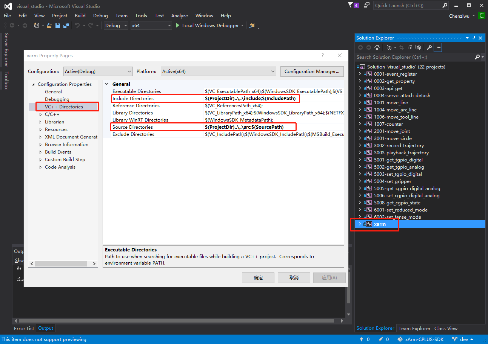
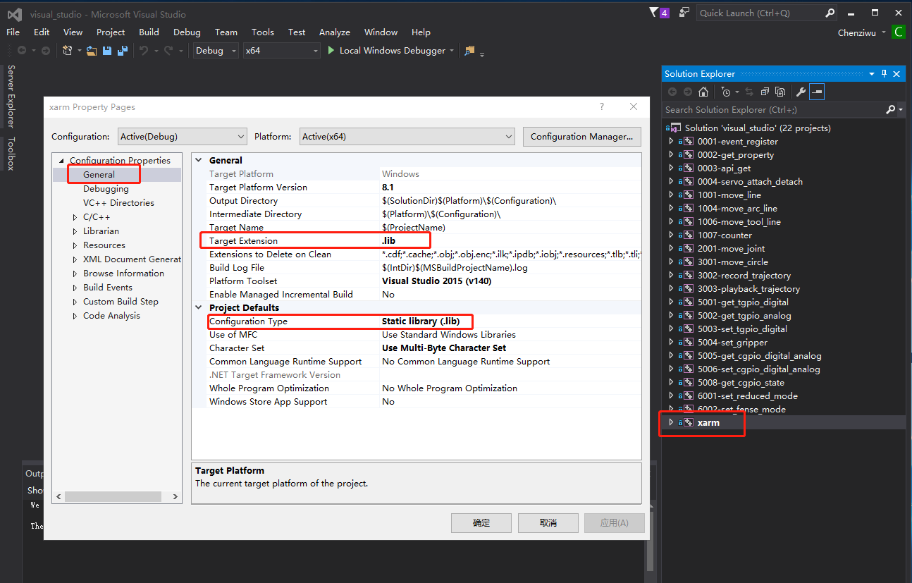
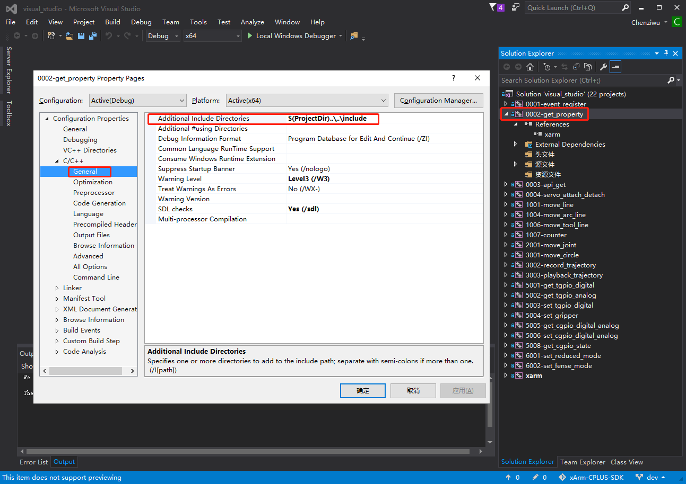
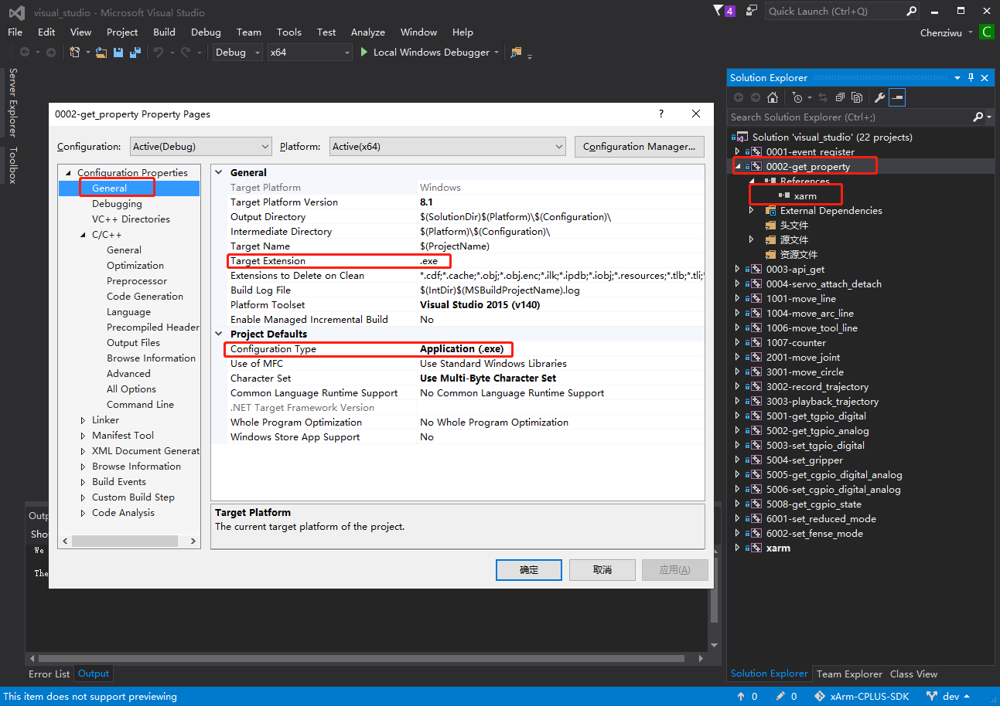
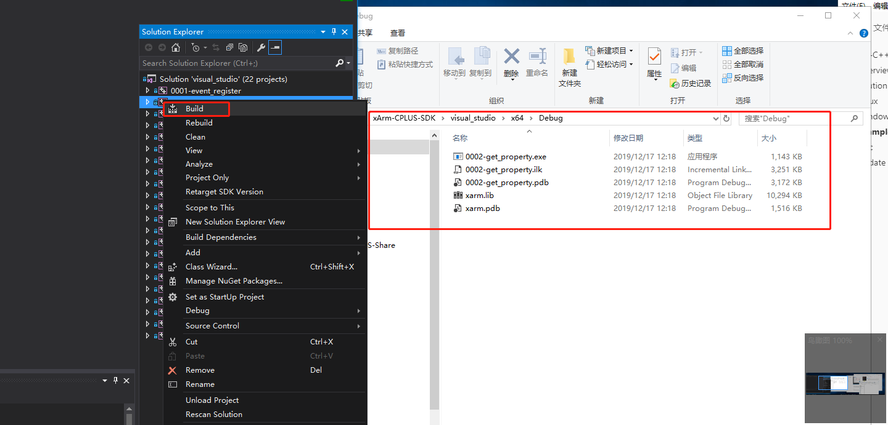
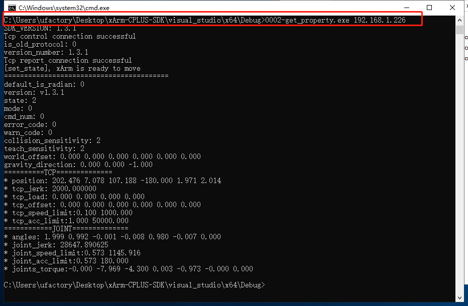

# xArm-C++-SDK


## Overview
- The current version supports Linux and windows, but the source code structure has changed.

## Caution
- During use, people should stay away from the robot arm to avoid accidental injury or damage to other items by the robot arm.
- Protect the arm before use.
- Before you exercise, please make sure you don't encounter obstacles.
- Protect the arm before unlocking the motor.


## Update Summary

- > ### 1.3.1
  - Support windows platform

- > ### 1.3.0

  - Added several attributes
  - Support tool coordinate system movement
  - Support joint range limitation, collision rebound setting
  - Support user coordinate system setting
  - Support the status of the air pump
  - Added counter interface

## Linux

- Get the code:

  ```
  git clone https://github.com/xArm-Developer/xArm-CPLUS-SDK.git
  ```

- Change directory

  ```
  cd ./xArm-CPLUS-SDK/
  ```


- Build library:
  ```bash
  make xarm
  ```

- Build all example

    ```bash
    make test
    ```

- Build a example

    ```bash
    make test-0002-get_property # build example/test-0002-get_property.cc
    ```

- Build all (build library and build all example)

    ```bash
    make # make xarm && make test
    ```

- Install

    ```bash
    sudo make install
    ```

- Uninstall

    ```bash
    sudo make uninstall
    ```

- Run a example

    ```bash
    ./build/example/0002-get_property 192.168.1.221
    ```


## Windows

- Running environment

  ```
  It is recommended to run the project with visual studio 2015.Make sure your visual studio 2015 has a visual C++ development environment installed before running.
  ```
  
- Get the code:

  ```
  git clone https://github.com/xArm-Developer/xArm-CPLUS-SDK.git
  ```

- Change directory

  ```
  Change your directory xArm-CPLUS-SDK/visual_studio
  ```

- Open project

  ```
  If you changed your directory, you can see a visual_studio.sln file. Click this file you will open the project.
  ```


- Check the xarm project properties

  ```
  Open the xarm property pages and make sure your project configuration is the same as the following screenshot configuration.
  
  VC++ Directories path 
  	$(ProjectDir)..\..\include
  	$(ProjectDir)..\..\src
  ```

  

  

  

- Check the example project properties
  
  ```
  Open the example property pages and make sure your project configuration is the same as the following screenshot configuration.
Example project dependencies and xarm projects so references must be added to run.
  ```
  
  
  
  


- Build project

  ```
  Right click example project and build the projiect.If the example project bulid successful you will get a .exe file in you project path.
  
  .exe path like this C:\Users\ufactory\Desktop\xArm-CPLUS-SDK\visual_studio\x64\Debug\0002-get_property.exe
  ```

  

  

- Run project

  ```
  You can use cmd run project.
  ```

  


- New project

  ```
  If you want to create a new project, you need to pay attention to the dependent path of your new project. 
  You must make sure that the configuration of the project you create is the same as that of the example project.
  ```


## [Example](example/)

- ##### [0001-event_register](example/0001-event_register.cc)

- ##### [0002-get_property](example/0002-get_property.cc)

- ##### [0003-api_get](example/0003-api_get.cc)

- ##### [0004-servo_attach_detach](example/0004-servo_attach_detach.cc)

- ##### [1001-move_line](example/1001-move_line.cc)

- #####  [1004-move_arc_line](example/1004-move_arc_line.cc)

- #####  [1006-move_tool_line](example/1006-move_tool_line.cc)

- #####  [1007-counter](example/1007-counter.cc)

- ##### [2001-move_joint](example/2001-move_joint.cc)

- ##### [3001-move_circle](example/3001-move_circle.cc)

- ##### [3002-record_trajectory](example/3002-record_trajectory.cc)

- ##### [3003-playback_trajectory](example/3003-playback_trajectory.cc)

- ##### [5001-get_tgpio_digital](example/5001-get_tgpio_digital.cc)

- ##### [5002-get_tgpio_analog](example/5002-get_tgpio_analog.cc)

- ##### [5003-set_tgpio_digital](example/5003-set_tgpio_digital.cc)

- ##### [5004-set_gripper](example/5004-set_gripper.cc)

- ##### [5005-get_cgpio_digital_analog](example/5005-get_cgpio_digital_analog.cc)

- ##### [5006-set_cgpio_dialog_analog](example/5006-set_cgpio_digital_analog.cc)

- ##### [5008-get_cgpio_state](example/5008-get_cgpio_state.cc)

- ##### [6001-set_reduced_mode](example/6001-set_reduced_mode.cc)

- ##### [6002-set_fense_mode](example/6002-set_fense_mode.cc)


## Doc

- #### [API Document](doc/xarm_cplus_api.md)
- #### [API Code Document](doc/xarm_api_code.md)

